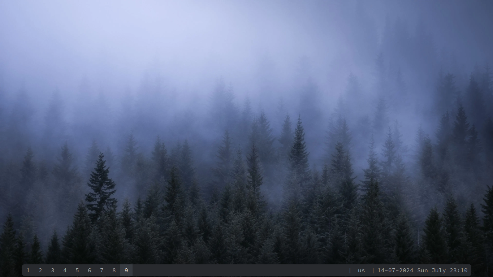
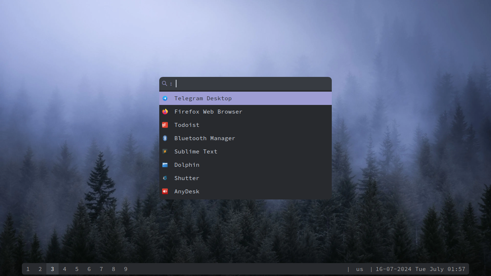
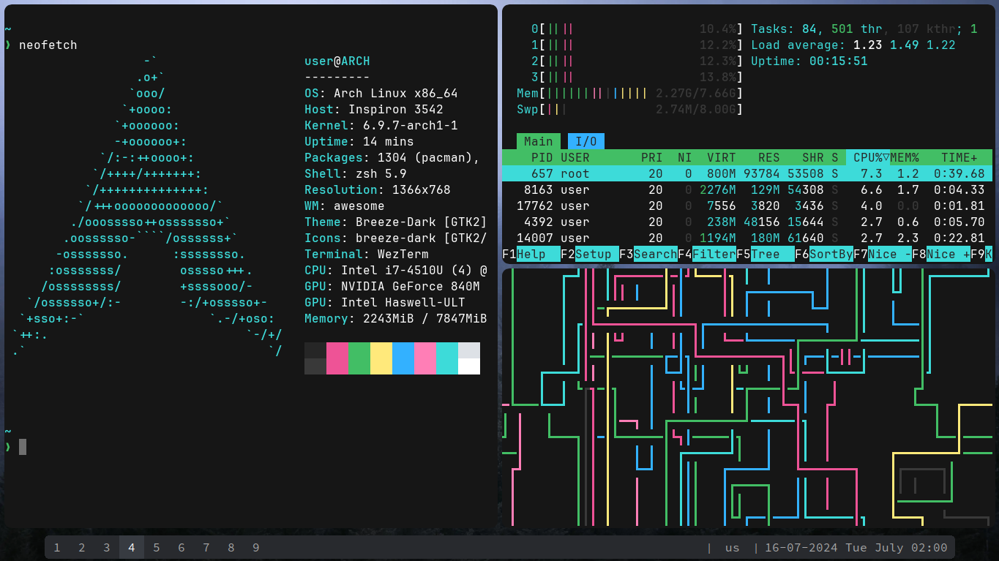

# Minimalistic dotfiles
### ⚙️ Featured configs 
* tmux
* awesomewm
* picom
* rofi
* wezterm
### 💻 System info
* Operating system - Arch Linux
* Code editor - Neovim ([my config](https://github.com/assense/nvim-config))
* Shell - zsh
### 📷 Screenshots
  
---
Enjoy!
